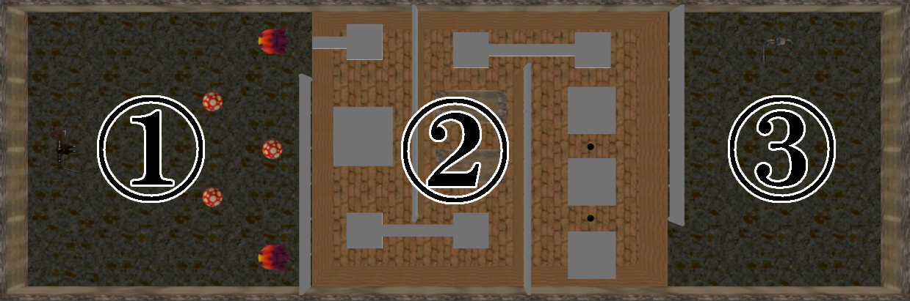

# Dungeon Ruler
### 作成者
河原電子ビジネス専門学校<br>
1年 橘 一生
# 目次
<details>
<summary>詳細</summary>

  1. [ゲーム概要](#1-ゲーム概要)
  2. [操作説明](#2-操作説明)
  3. [ソースコード](#3-ソースコード)

</details>

## __1. ゲーム概要__
▼第11回全国専門学校ゲームコンペティション応募動画<br>
[](https://www.youtube.com/watch?v=IK2ury61ALo)

***
* __ゲームジャンル__<br>
  3Dアクションゲーム<br>
* __ゲーム内容__<br>
  騎士を操作してダンジョン内の敵を倒し、ギミックをクリアして、ダンジョンの奥にいる支配者を倒す。
***
* __使用ゲームエンジン__<br>
  学校内製のゲームエンジンを使用
* __使用ツール__
  * Visual&thinsp;Studio 2022
  * 3dsMax 2023
  * Adobe Photoshop 2023
* __使用言語__
  * C++ 
* __開発環境__
  * Windows11
  * DirectX12
* __開発期間__<br>
  2022年9月～2023年1月
* __制作人数__<br>
  1人

## __2. 操作説明__
|操作|ボタン|
|:---:|:---:|
|ジャンプ|A|
|近接攻撃|B|
|魔法攻撃|X|
|移動|Lスティック|
|ダッシュ|Lスティック+RB|
|カメラ操作|Rスティック|

## __3. ソースコード__
<details>
  <summary>作成したソースコード</summary>

  * Background.cpp
    * Background.h
  * Boss.cpp
    * Boss.h
  * CheckPoint.cpp
    * CheckPoint.h
  * Fade.cpp
    * Fade.h
  * FireGimmic.cpp
    * FireGimmic.h
  * Game.cpp
    * Game.h
  * GameCamera.cpp
    * GameCamera.h
  * MagicBall.cpp
    * MagicBall.h
  * MagicThunder.cpp
    * MagicThunder.h
  * Map.cpp
    * Map.h
  * MovingFloor.cpp
    * MovingFloor.h
  * MovingFloorZ.cpp
    * MovingFloorZ.h
  * MushRoomMan.cpp
    * MushRoomMan.h
  * Player.cpp
    * Player.h
  * SeesawFloor.cpp
    * SeesawFloor.h
  * StoneMonster.cpp
    * StoneMonster.h
  * Title.cpp
    * Title.h
</details>
<details>
<summary>追記したソースコード</summary>

  * PhysicsStaticObject.h
    * SetRotation関数を追加
  * RenderingEngine.h
    * m_grayscale変数を追加
  * DeferredLighting.fx
    * 406行目～412行目のグレースケールの処理を追加
  * PBRLighting_struct.h
    * 59行目のgrayscale変数を追加

</details>

## __4. ステージ__
  ステージは以下の3つで構成されています。
 
 ① 雑魚敵との戦闘<br>
 ② ステージギミックのあるアスレチックコース<br>
 ③ ボス戦

 ## __5.ギミック紹介__

  ### 1. 動く床<br>
   * 床が前後や左右に移動します<br>
   * 床の上に乗るとプレイヤーも一緒に移動します<br>
   * 床の移動速度をプレイヤーの移動速度に加算して実装しました<br>

[](https://www.youtube.com/watch?v=U87YqJSWFL8)

  ### 2. 氷の床<br>
  *  傾く床の上に乗ると傾きによってプレイヤーが滑ります
  *  既存のエンジンには静的物理オブジェクトを回転させるための処理がなかったため、PhysicsStaticObject.hのSetPosition関数を参考にSetRotation関数を作成しました<br>
  ```C++
  void SetRotation(const Quaternion& rot)
		{
			auto& btTrans = m_rigidBody.GetBody()->getWorldTransform();
			btQuaternion btRot;
			btRot = btQuaternion(rot.x,rot.y,rot.z,rot.w);
			btTrans.setRotation(btRot);
		}
  ```
  [](https://www.youtube.com/watch?v=FPwZ4YPGl8Y)


